# USB-C Power Adaptor for BBC Micro

[Purchase Link](https://www.tindie.com/products/31079/) | [Official Discord](https://discord.gg/HAuuh3pAmB) | [Table of Contents](#table-of-contents)

----

This adaptor lets you power your BBC micro via USB-C.

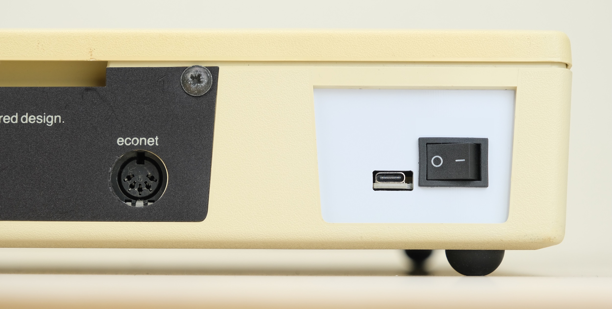

It replaces the original PSU, and uses common USB chargers instead.

## Highlights

* **Non-destructive** and reversible

* Use USB charger or power bank

* Low cost, efficient and reliable.

## Get One / Other Stuff

[Click me to get one!](https://www.tindie.com/products/31079/)

Also available for [**Mac 128K, SE, Apple II/IIGS, Osborne 1, Apricot PC, BBC Micro, and more!**](./README.md)

For more general-purpose diagnostics and retrofitting, check out the [full-fat ATX4VC](https://github.com/dekuNukem/ATX4VC)!

## Table of Contents

- [Kit Assembly](#kit-assembly)

- [Pre-flight Checks](#pre-flight-checks)

- [Installation](#installation)

- [Questions or Comments?](#questions-or-comments)

## Kit Assembly

### Parts

Observe the parts:

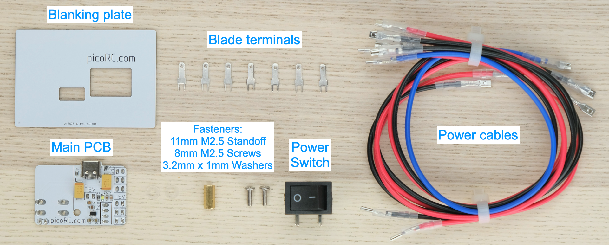

### Soldering Notes

Nothing too tricky in this kit, all basic through-hole stuff.

If this is your first time, a few tips:

* Make sure your soldering iron has **proper temperature control**. Try your local makerspace or university lab.

* Use **leaded solder** and plenty of flux, temperature around 320C / 600F.

* [This video](https://www.youtube.com/watch?v=AqvHogekDI4) covers the basics pretty well.

### Assembly

Insert the terminal blades and soldering them in place.

Make sure they are straight!

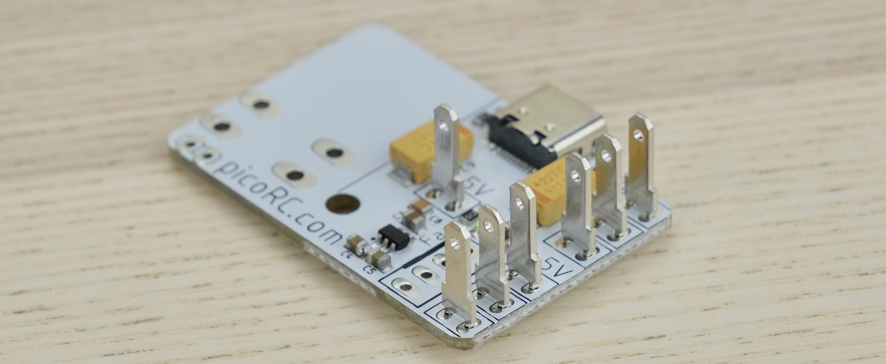

Push the power switch into the blanking plate as shown.

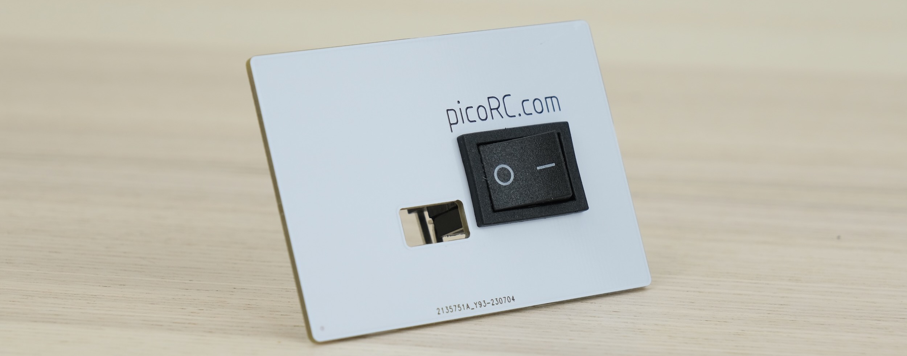

Offer up the switch assembly.

Make sure the switch sits flat. Adjust the two PCB so they are at **right angle**.

Once happy, solder the switch in place.

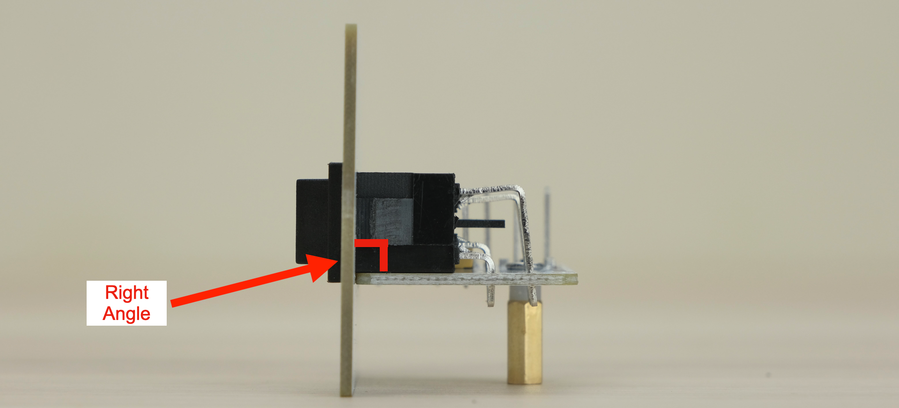

That's pretty much it!

### Cleaning

This is optional, but I like to clean off the flux with 90%+ isopropyl alcohol.

Submerge and scrub with a toothbrush.

Make sure it is **completely dry** before proceeding.

### Inspection

* Compare with the reference photos below.

* Solder joints should be **shiny and smooth**. If you see spikes, put on more flux and melt it again.

* There must be **no solder bridges**. If any, put on flux and melt it to remove.

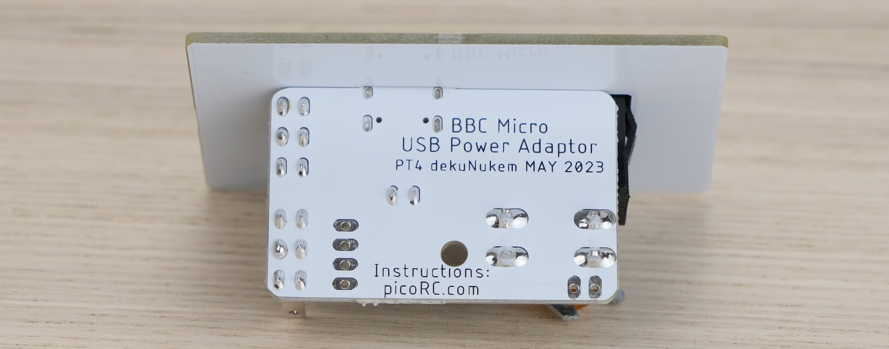

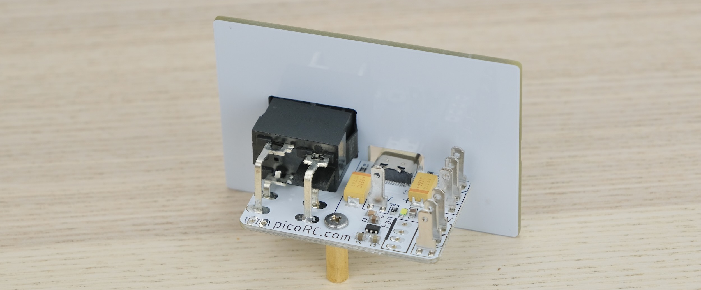

## Pre-flight Checks

Use a multimeter to **check for dead shorts** between each rail and GND.

If all good, plug in a USB cable, turn on, and check the voltages.

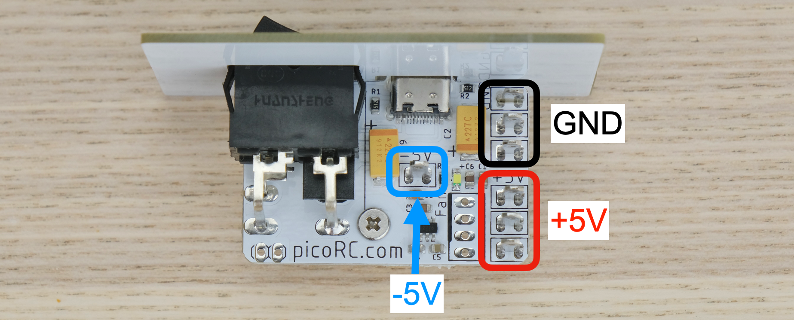

## Installation

Push the cables into the terminal blades.

* Red is 5V

* Black is GND

* Blue is -5V

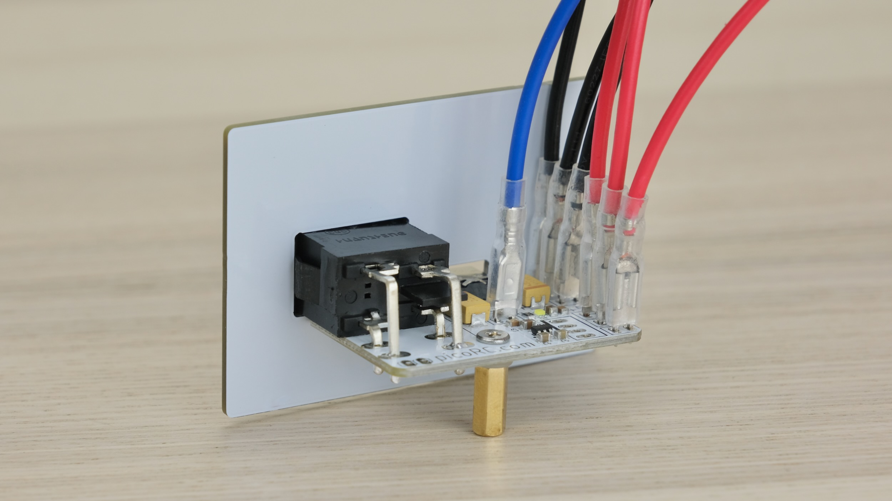

Place the Beeb on a soft towel. Remove the screws shown.

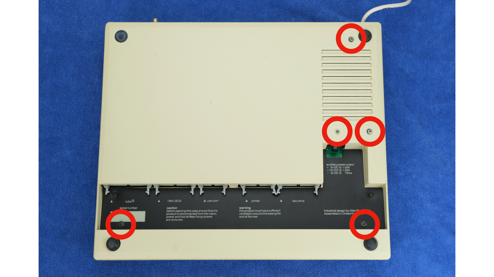

Flip over, remove the two screws shown.

Remove the top cover.

Loosen the two nuts shown to free up the keyboard.

Unplug and remove the power supply.

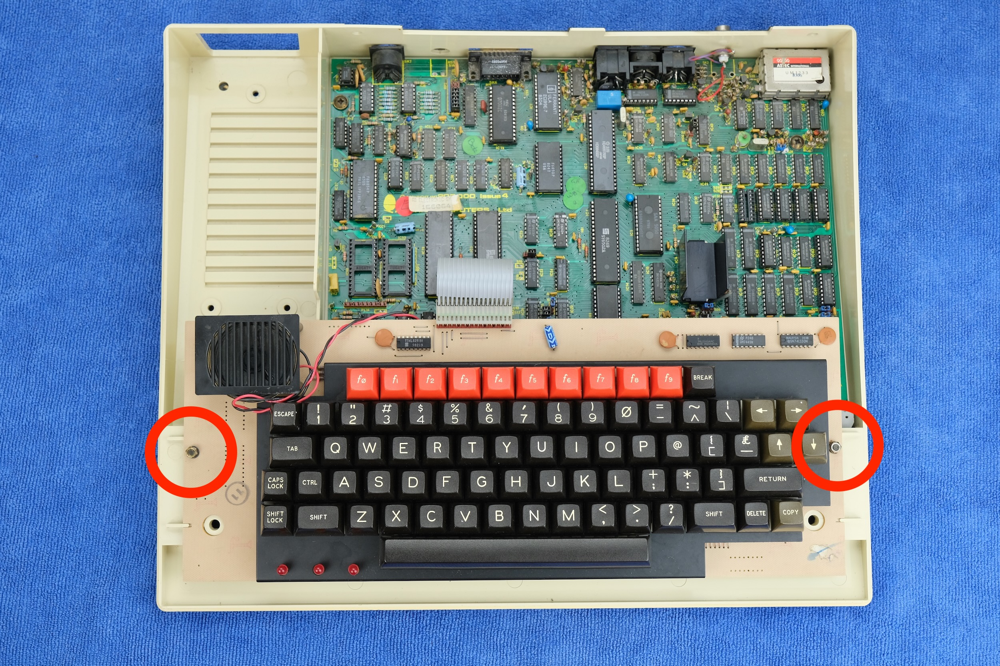

Insert the screw from the bottom as shown.

Then the washers, and the standoff. Tighten with a 5mm socket.

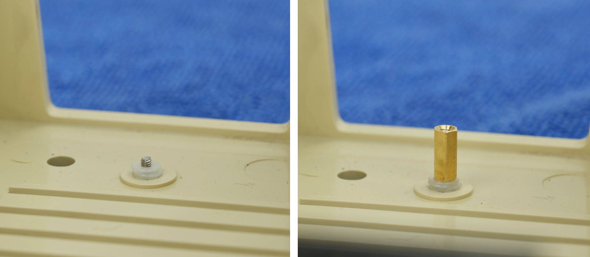

Install the adaptor, secure with the screw.

Connect the other end to the motherboard as shown.

VCC is red, 0V is black, -5V is blue.

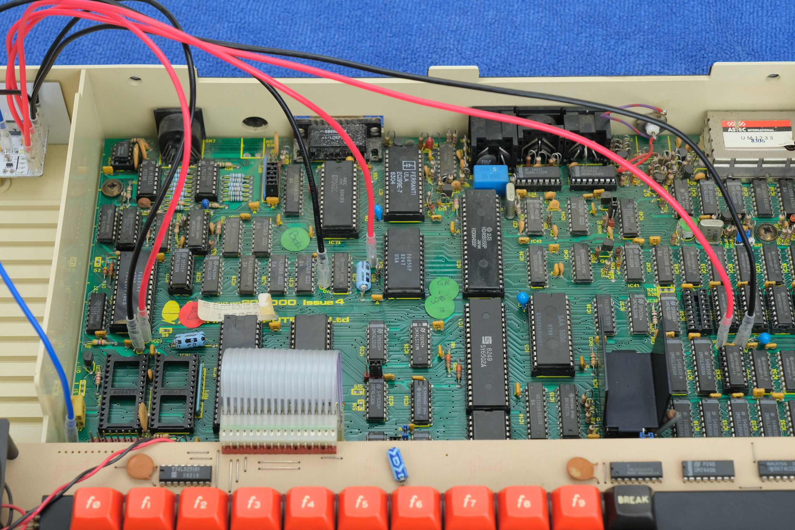

Feel free to turn on and try it out!

* The charger / power bank should provide at least 3A current.

* Make sure the USB-C cable is high quality.

* Otherwise instabilities might occur.

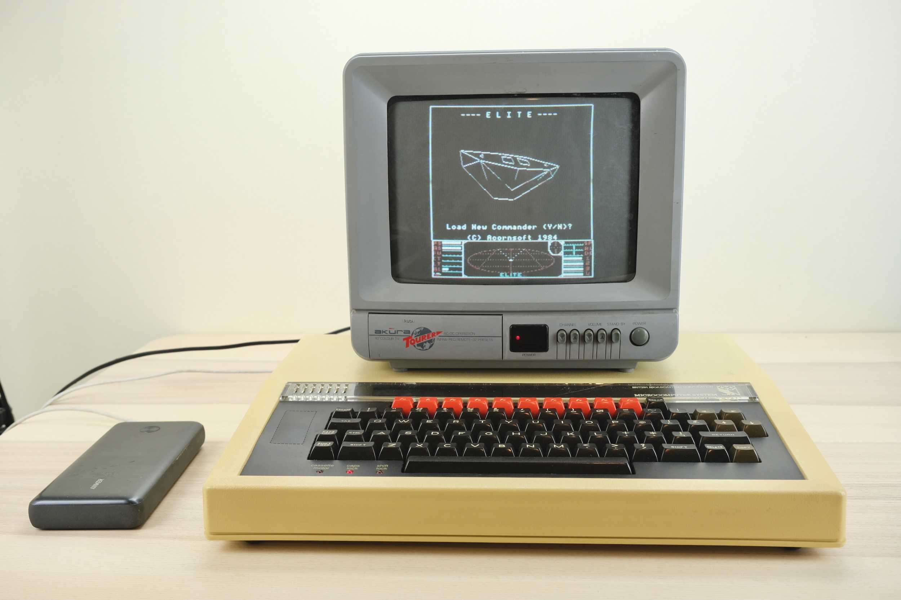

If it works, tuck the wires neatly and reassemble. Enjoy!

## Questions or Comments?

Feel free to ask in official [Discord Chatroom](https://discord.gg/T9uuFudg7j), raise a [Github issue](https://github.com/dekuNukem/PicoRC/issues), or email `dekunukem` `gmail.com`!
