# PicoPSU Adaptor for IBM PC Compatibles

[Purchase Link] | [Official Discord](https://discord.gg/HAuuh3pAmB) | [Table of Contents](#table-of-contents)

----

# UNDER CONSTRUCTION !!

This adaptor lets you use **Pico ATX PSU** on IBM PC and clones. 

From the original PC 5150 all the way to the Pentium III era!

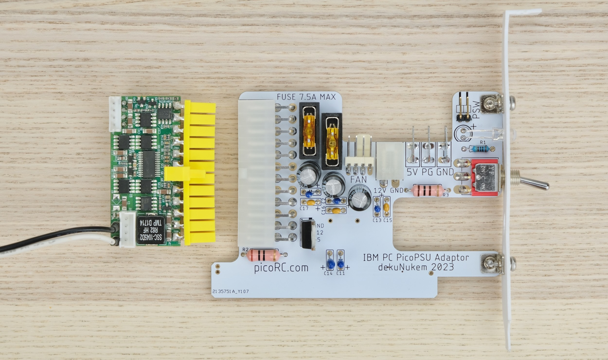

The PSU-in-a-Card replaces the original PSU, and uses very common **12V power brick** instead.

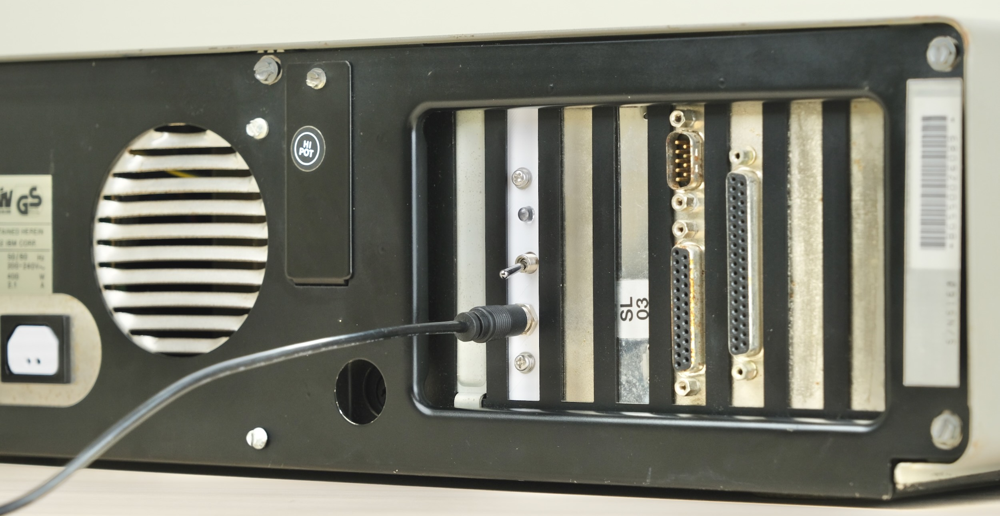

## Features

* **Non-destructive**

* Onboard **-5V regulator**

* **PC fan** header

* Built-in power switch, also supports external switch.

## Get One / Other Stuff

[Click me to get one!]

Also available for [**Mac 128K, Mac SE, Apple II/IIGS, Osborne 1, Apricot PC, BBC Micro, and more!**](./README.md)

For more general-purpose diagnostics and retrofitting, check out the [full-fat ATX4VC](https://github.com/dekuNukem/ATX4VC)!

## Table of Contents

- [Getting a Pico PSU](#getting-a-pico-psu)

- [Kit Assembly](#kit-assembly)

- [Pre-flight Checks](#pre-flight-checks)

- [Installation](#installation)

- [Questions or Comments?](#questions-or-comments)

## Getting a Pico PSU

PicoPSUs are tiny ATX power supplies for small PCs, but are perfect for retro computers as well.

* [Official website](https://www.mini-box.com/DC-DC) and [distributors](https://www.mini-box.com/site/resellers.html).

* The **160W** one is recommended.

* The cheaper 80 or 120W should also work on PCs **without** spinning hard drives.

* Avoid generic clones. They over-rate and are of low quality.

* A power brick with **12V DC** and **center positive** 5.5x2.5mm barrel jack is needed.

* They are very popular and you might already have one. Make sure it has enough wattage.

Remember that this solution is **only as good as your PicoPSU and 12V Brick**, so don't skimp on them!

## Kit Assembly

**DON'T START YET!!!** Keep reading :)

Observe the parts:

Optional IBM 5155 Kit:

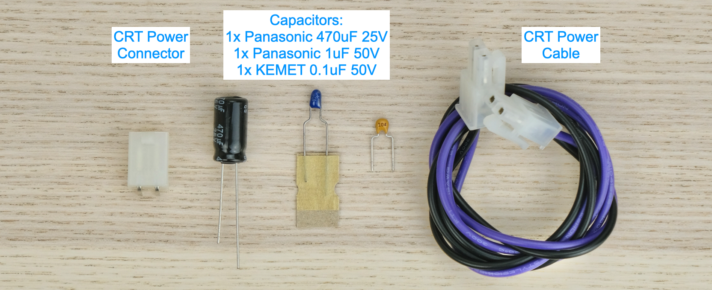

### Soldering Notes

Nothing too tricky in this kit, all basic through-hole stuff.

If this is your first time, a few tips:

* Make sure your soldering iron has **proper temperature control**. Try your local makerspace or university lab.

* Use **leaded solder** and plenty of flux, temperature around 320C / 600F.

* [This video](https://www.youtube.com/watch?v=AqvHogekDI4) covers the basics pretty well.

### Assembly

Solder the components **as shown below**:

* Double check capacitor polarity!

* Black electrolytic caps: White stripe is **NEGATIVE**.

* Blue Tantalum caps: White stripe is **POSITIVE**.

* Yellow ceramic caps: No polarity.

### Cleaning

This is optional, but I like to clean off the flux with 90%+ isopropyl alcohol.

Submerge and scrub with a toothbrush.

Make sure it is **completely dry** before proceeding.

### Inspection

* Compare with the photo and notes above. Make sure everything is in correct orientation.

* Solder joints should be **shiny and smooth**. If you see spikes, put on more flux and melt it again.

* There must be **no solder bridges**. If any, put on flux and melt it to remove.

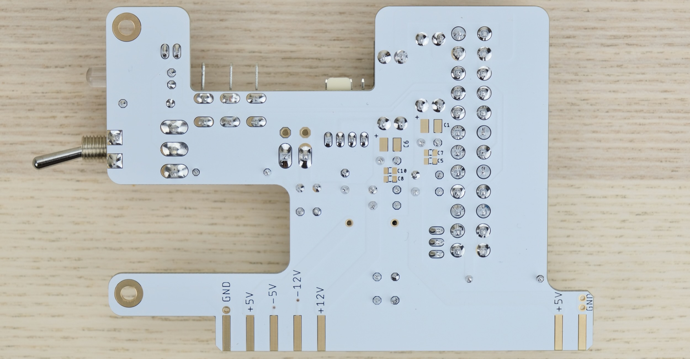

### Bracket

Install the metal bracket.

The shorter side should be touching the PCB.

Secure with M3 screws from the bottom.

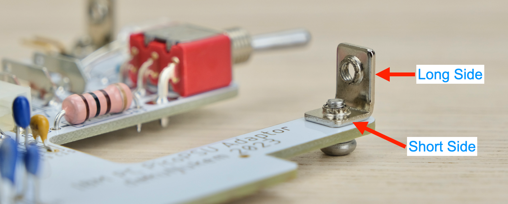

Then install the ISA bracket, secure with two more M3 screws.

## Pre-flight Checks

Install two 5A fuses.

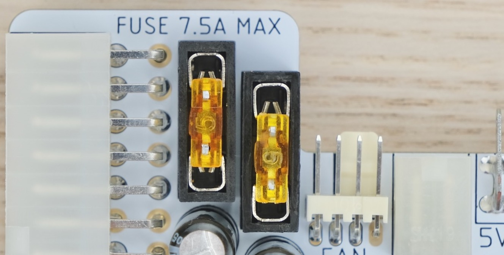

Use a multimeter to **check for dead shorts** between each power rail and GND:

If all good, plug in PicoPSU, and flip the switch.

The LED should light up. The LED is wired to the `POWER_GOOD` signal, so there might be a slight delay.

Measure the voltage of each rail, make sure they are correct. 

## Installation

Undo the locking ring on the barrel jack.

Insert through the hole on the bracket.

Tighten the ring from the other side. Use 10mm socket.

Insert the power cables into the terminal blades.

* Match the colours! (RED: 5V | ORANGE: PowerGood | BLACK: GND)

* Ensure the connectors are **all the way in**.

* Ensure the **insulating sleeves** are in place.

Now we're ready to install!

I'll be using an IBM PC XT as an example.

**⚠️⚠️ IMPORTANT ⚠️⚠️**

Insert the blanking plug into the power socket.

This prevents the old faulty/unknown PSU from being accidentally energized.

Undo the screws in the back, and slide the cover forward to remove.

Insert the card into a free ISA slot, secure with screw.

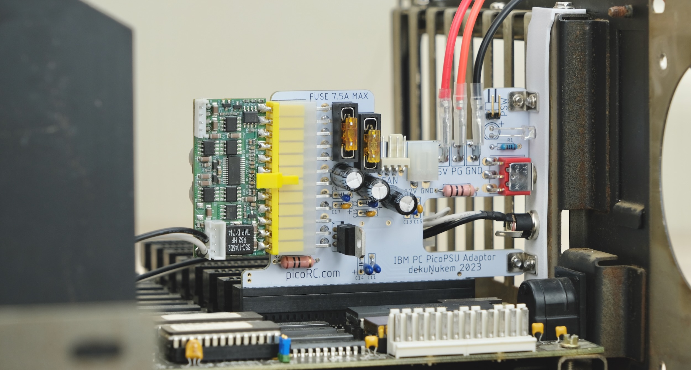

Insert a flat-blade screwdriver into the blade receptacle.

Expand the gap slightly so it goes in easier.

Now take a look at the AT-style connector.

We just need to insert the cables into the appropriate pins.

Other rails will be fed through the ISA bus.

Let's start with the **RED** 5V cable.

Any will do, but I suggest the rightmost pin, easier to remember.

Push **straight down**, make sure **lobe side faces outwards**.

Don't force if there is significant resistance, make the gap bigger and try again.

On the other hand, it shouldn't be too loose either.

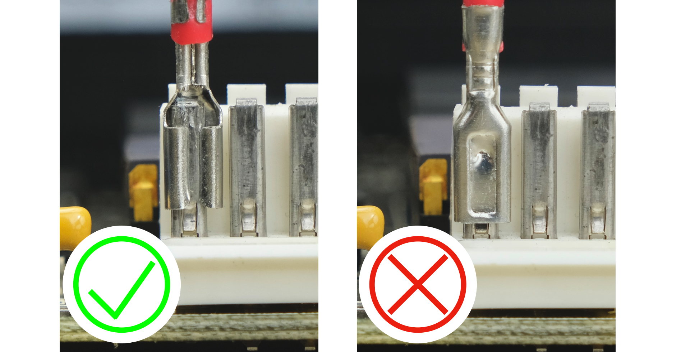

Repeat with the other two wires.

**BLACK** GND wire can be any of the four pins in the middle.

**ORANGE** PG wire is on the other edge.

Make sure they are **all the way in**, and covered with **insulation sleeve**.

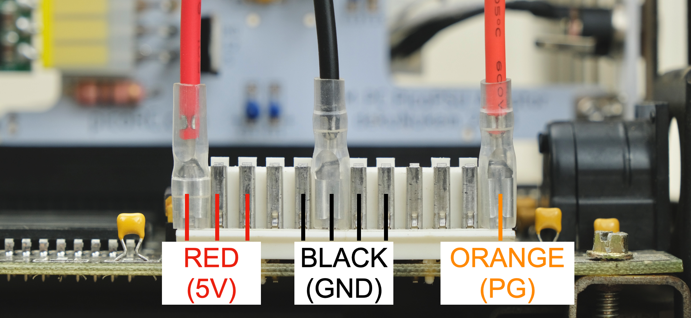

Double check the connection:

---------

Some PC uses **non-standard connectors**, in which case you'll need to figure it out yourself.

* Check schematic if available.

* 5V is almost always **RED**.

* GND is almost always **BLACK**.

* PG can be different, but AT convention is **ORANGE**.

Let's take a look at a few examples.

#### Dell 466/T

The connector is in two rows, but everything else is the same. So just match the colors.

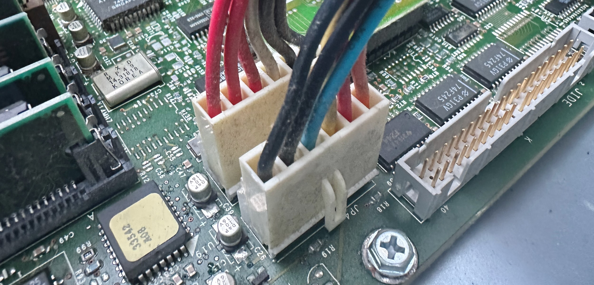

#### Hyundai/Novel PCTerminal (HPT-100)

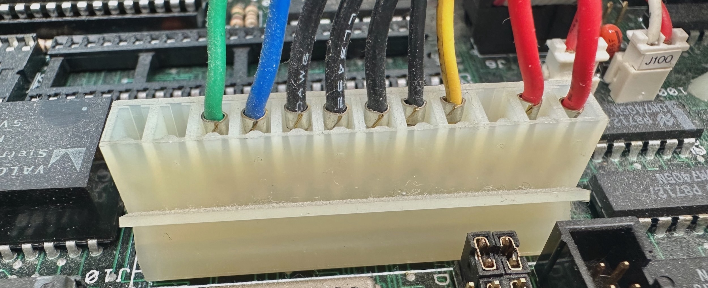

It uses a different connector, but the pinout is mostly the same (RED 5V on the edge, BLACK GND in the middle, PG is unused).

It also has square pins, in which case you can plug one of the lobes into it.

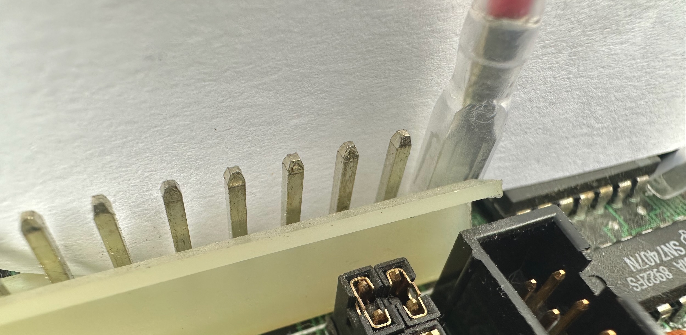

#### Compaq Deskpro 286

This one's a doozy, completely propitiatory connector and pinout.

Most rails are labelled, but not the PG signal, couldn't find a schematic.

In this case, you can open up the PSU and see if it is labelled there. 

[Fortunately it was](photos/ibmpc/compaqpsu.jpeg), so here is the pinout for prosperity:

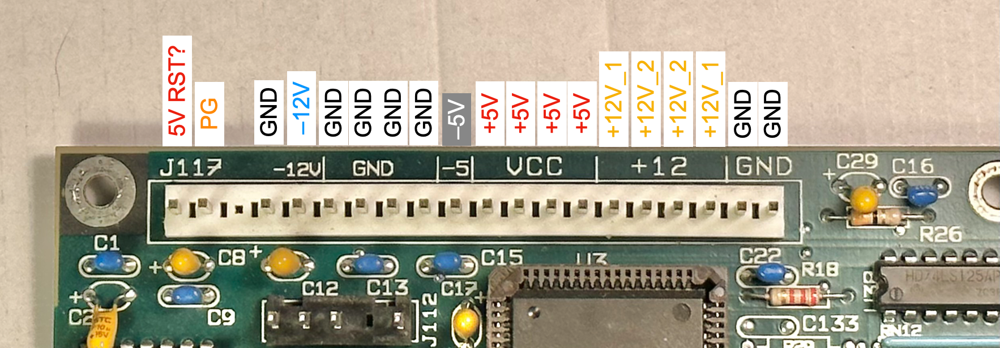

## Moment of Truth

If testing an unknown PC, it is recommended to start minimal with just the motherboard and video card. Remove all extra cards and disconnect the drives.

Plug in and flip the switch!

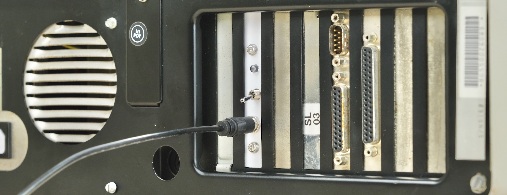

If it works, congrats! You can now add more parts back in.

For drives, use the harness that came with the PicoPSU.

Keep an eye on the temperature of the PicoPSU.

Active ventilation might be needed if it gets too hot.

Any standard 12V PC fan should work.

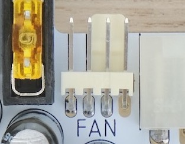

## External Power Switch

A **PSW header** is available for external power switch.

The PSU will turn on when the two pins are shorted together.

Normally you can simply connect a switch or latching button to it.

However, if you want to use the Big Red Switch™, there are a few more steps.

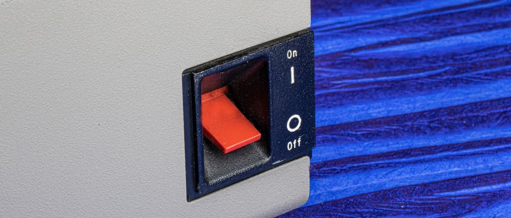

Normally, the Big Red Switch™ is part of the old PSU, so you would need to take it apart.

Inside, you'll most likely find a Double Pole Single Throw (DPST) switch, which switches two circuits at once.

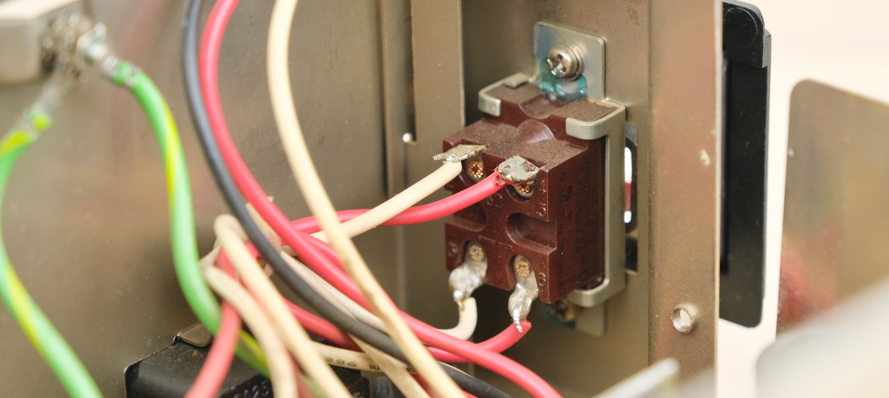

Note the colour of the wires.

The **same colored** wire are **connected together** when the switch is on.

⚠️⚠️ **MAINS VOLTAGE flows through this switch!!!** ⚠️⚠️ 

Make sure to first **unplug/cut/desolder** all wires going into the switch!

Then you can connect one side of it to the PSW header, with test clip and jumper wires.

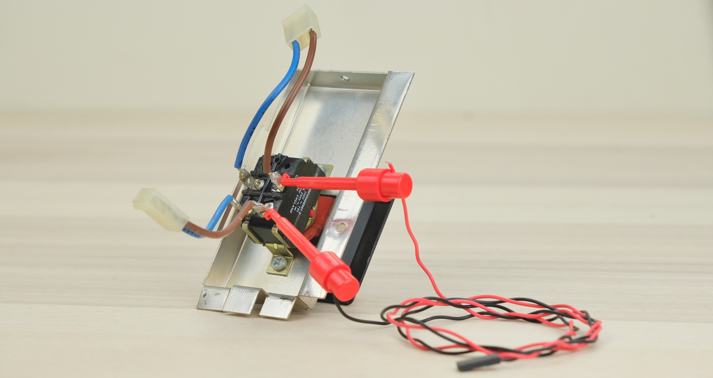

## IBM 5155 Instructions

## Questions or Comments?

Feel free to ask in official [Discord Chatroom](https://discord.gg/T9uuFudg7j), raise a [Github issue](https://github.com/dekuNukem/PicoRC/issues), or email `dekunukem` `gmail.com`!
