# PicoPSU Adaptor for Osborne 1

[Purchase Link](https://www.tindie.com/products/30087/) | [Official Discord](https://discord.gg/HAuuh3pAmB) | [Table of Contents](#table-of-contents)

----

This adaptor lets you use **Pico ATX PSU** on Osborne 1 computer.

It replaces the original PSU, and uses very common **12V power brick** instead.

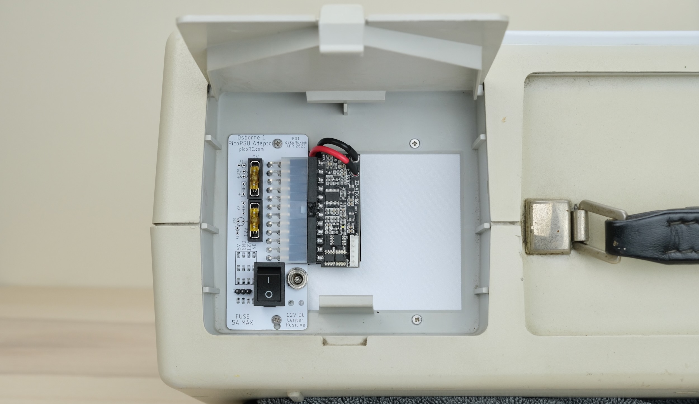

## Highlights

* **Non-destructive** and reversible

* **PC fan header** for more cooling

* Universal voltage with fused rails

* Low cost, efficient and reliable.

## Get One / Other Stuff

[Click me to get one!](https://www.tindie.com/products/30087/)

Also available for [Compact Macintosh, Apple IIGS, BBC Micro, Osborne 1, and more!](./README.md)

For more general-purpose diagnostics and retrofitting, check out the [full-fat ATX4VC](https://github.com/dekuNukem/ATX4VC)!

## Table of Contents

- [Getting a Pico PSU](#getting-a-pico-psu)

- [Kit Assembly](#kit-assembly)

- [Pre-flight Checks](#pre-flight-checks)

- [Installation](#installation)

- [Questions or Comments?](#questions-or-comments)

## Getting a Pico PSU

PicoPSU are tiny ATX power supplies for small PCs, but are perfect for retro computers as well.

* [Official website](https://www.mini-box.com/DC-DC) and [distributors](https://www.mini-box.com/site/resellers.html). Even the cheapest 80W one should be plenty.

* Avoid generic clones. They over-rate and are of low quality.

* A power brick with **12V DC** and **center positive** 5.5x2.5mm barrel jack is needed.

* They are very popular and you might already have one. Make sure it has enough wattage.

Remember that this solution is **only as good as your PicoPSU and 12V Brick**, so don't skimp on them!

## Kit Assembly

**DON'T START YET!!!** Keep reading :)

Observe the parts:

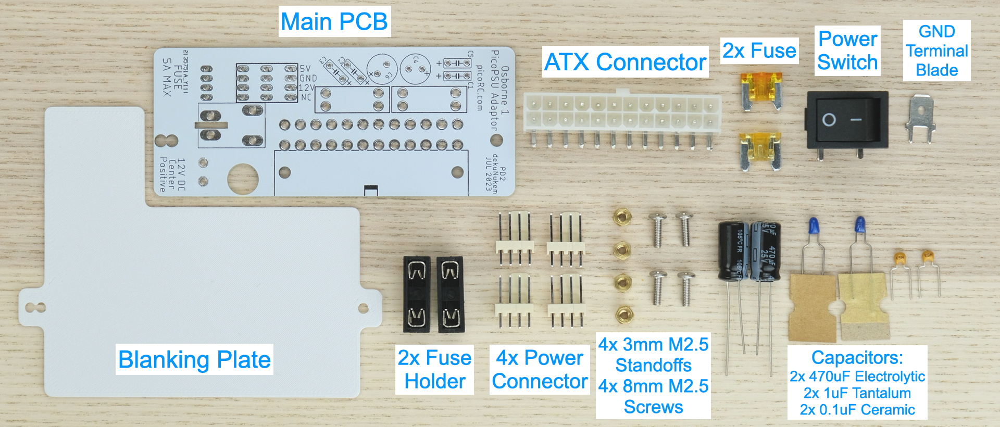

### Power Switch Preparation

Use needle-nose pliers, bend the leg on the power switch straight, then cut them to equal length.

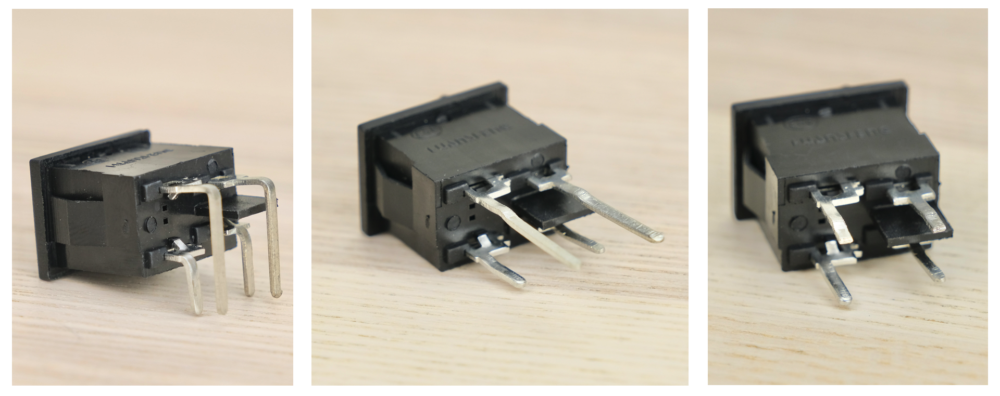

### Soldering Notes

Nothing too tricky in this kit, all basic through-hole stuff.

If this is your first time, a few tips:

* Make sure your soldering iron has **proper temperature control**. Try your local makerspace or university lab.

* Use **leaded solder** and plenty of flux, temperature around 320C / 600F.

* [This video](https://www.youtube.com/watch?v=AqvHogekDI4) covers the basics pretty well.

* Start from shortest to tallest. Solder **a single pin** first, and make sure the part is straight.

### Assembly

On **top side**, solder the following components **as shown below**:

* Fuse holders

* ATX connector

* Capacitors

* Power Switch

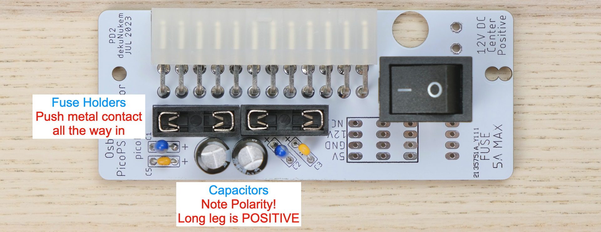

Flip over, on **bottom side**, solder:

* Four 4-Pin Connectors

* Grounding Blade

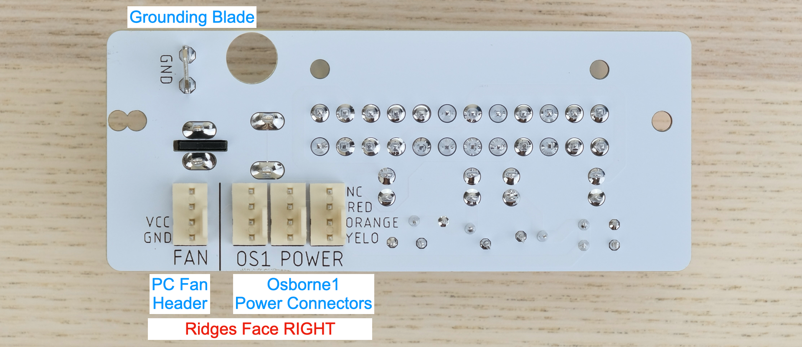

More reference photos:

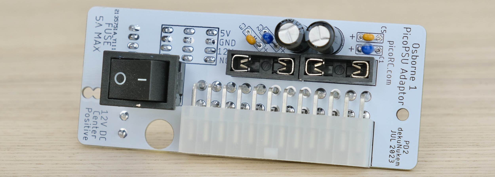

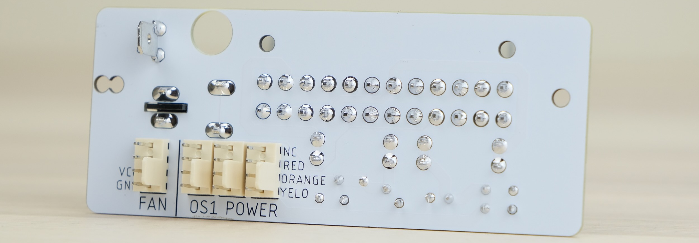

### Cleaning

This is optional, but I like to clean off the flux with 90%+ isopropyl alcohol.

Submerge and scrub with a toothbrush.

Make sure it is **completely dry** before proceeding.

### Inspection

* Compare with the reference photo and notes above. Make sure everything is in correct orientation.

* Solder joints should be **shiny and smooth**. If you see spikes, put on more flux and melt it again.

* There must be **no solder bridges**. If any, put on flux and melt it to remove.

## Board Features

Install **two 5A fuses** as shown.

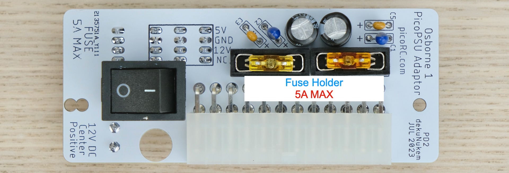

* Use common car fuse rated **5A OR LESS**

* **DO NOT BYPASS FUSES**

## Pre-flight Checks

Use a multimeter to **check for dead shorts** between each power pin and GND:

If all good, plug in PicoPSU and connect the power button, turn it on.

**Measure the voltage on each rail** and confirm they are within spec.

## Installation

Some disassembly is needed, make sure to **take plenty of photos** along the way! 

Snap one before removing a screw or unplugging a connector! It never hurts to have reference.

-------

I'm using a new-to-me and untested Osborne 1 in this guide, excuse the dust!

The adaptor should also work with the early version as well, although you'll need to take the whole innards out.

* Put it on a soft towel, unlatch and unplug the keyboard.

* Remove Brightness and contrast knob.

* Undo the tiny screw at the bottom, if doesn't exist, just pull it off.

* Undo the 6 face plate screws

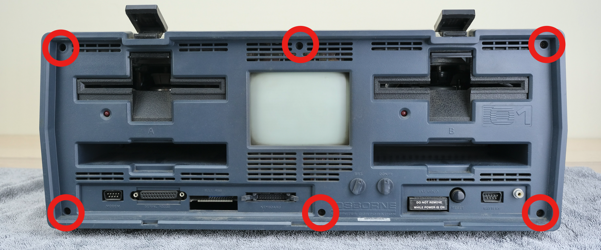

* Organise your screws! 

* At each stage, put em in a bag with labels to avoid mix-ups.

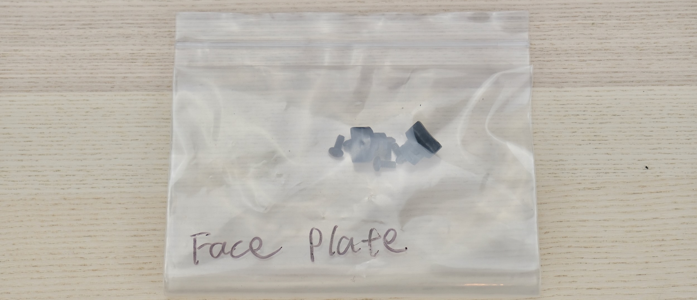

* Flip it over, undo five screws and remove the back cover

* Turn it around so the back is facing you

* Lift off the handle plate

* Lift off the power panel

* Undo the four screws on the power panel

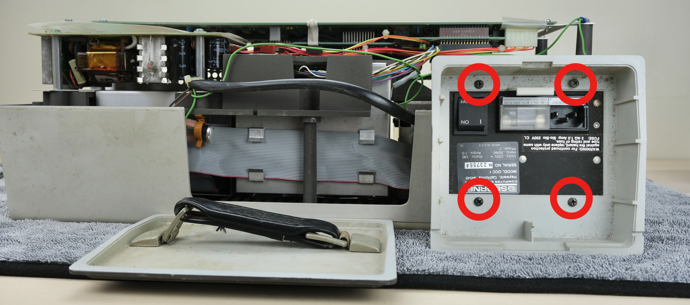

* On the back, unplug all the cables until the panel can be removed.

* Use a pair of pliers and wiggle side to side

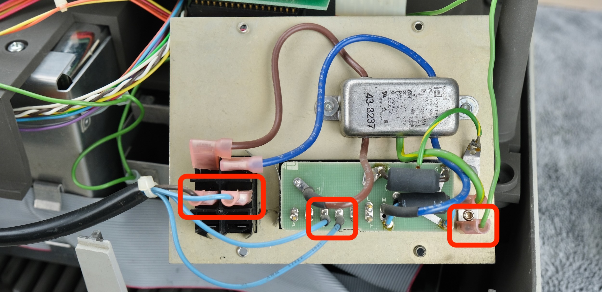

* Once removed, put the screws back on the plate, along with plastic sheet and rubber cap.

* Put it away for safekeeping along with all the other items removed. **Don't throw anything away!**

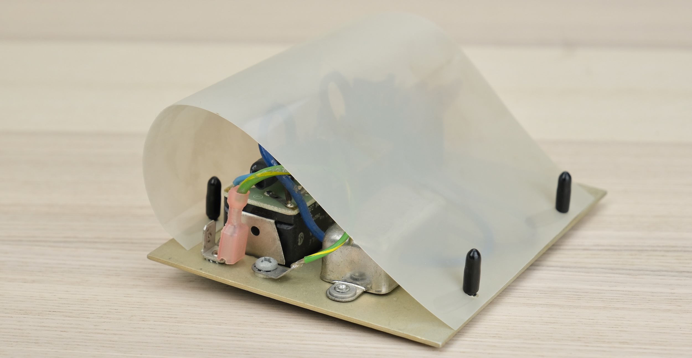

* Remove four motherboard bracket screws

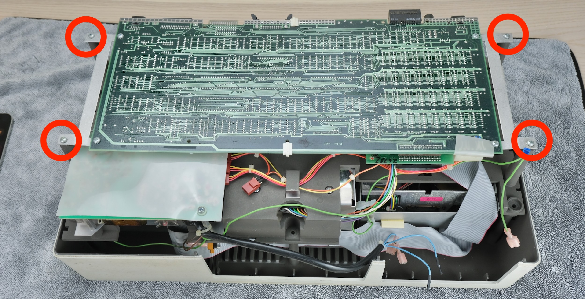

* Hinge the motherboard toward you and rest it on the table

* Now it's a good time for an inspection

* This one has the "Screen-Pac" and dual-density floppy upgrade, neat!

* Once done, undo the four screws on the PSU. (Two under the plastic sheet)

* Cut the ziptie

* Flip over the PSU, unplug all the cables, and put it away.

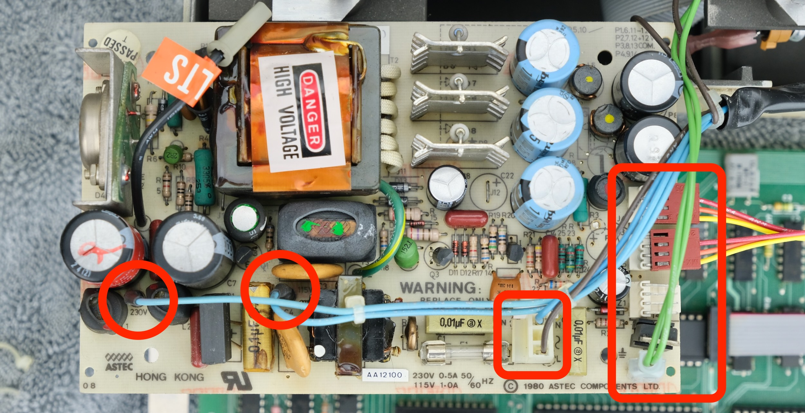

* Pop out the thermal fuse and remove the wiring harness

* Put the PSU screws and sheet back on the standoff so you don't lose them.

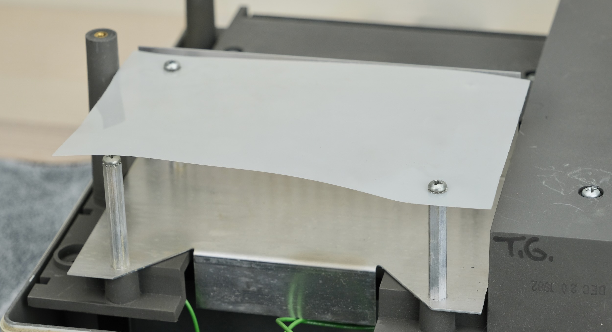

* With all the extra stuff removed, now it's a good time to see if your Osborne still works.

* There should be two or three 4-Pin power connectors, with **RED**, **ORANGE**, and **YELLOW** wires. One pin is unpopulated.

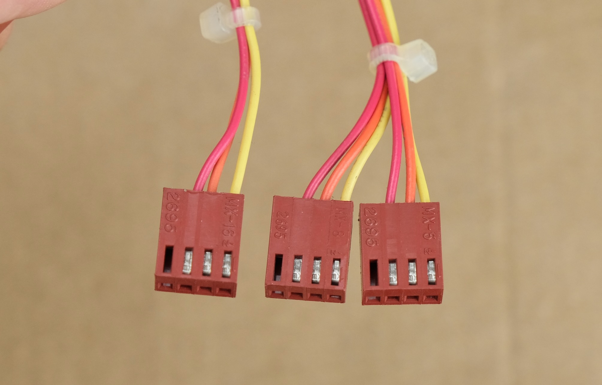

* Plug them into the power connectors, make sure to **match the colours** shown on the PCB.

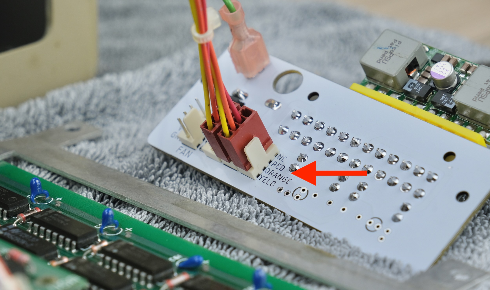

* Connect the barrel jack, flip on the switch, and see what happens!

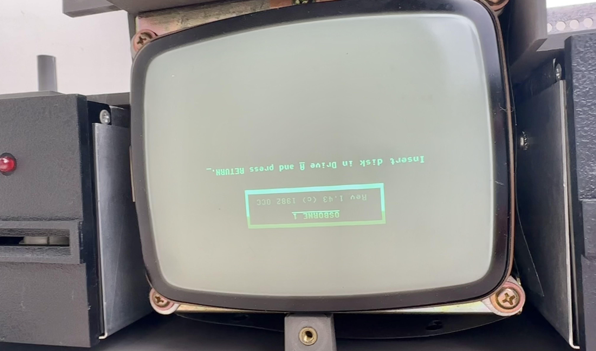

* Amazingly, this one works! I'm surprised! 😅

* The RAM tends to go bad a lot, so start there if not working.

* At this age, it's a good idea to do a teardown and clean anyway.

* Blow out dust, lube the floppy, check for cracked solder joints on the CRT board, etc.

--------

* Anyway, after you're done, we can start putting it back together!

* Install the adaptor as shown in the power panel holder.

* Note the orientation!

* Bend the cable so it goes inwards.

* Use the standoff to secure it from the other side.

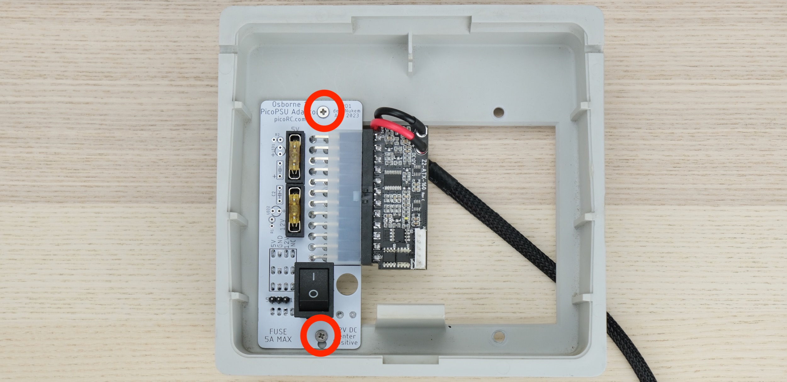

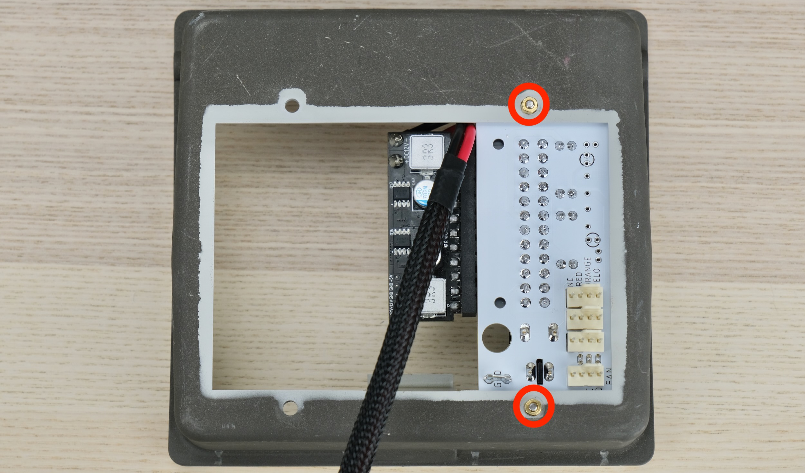

* Install the blanking plate on the inside. Secure with screws and standoffs as before.

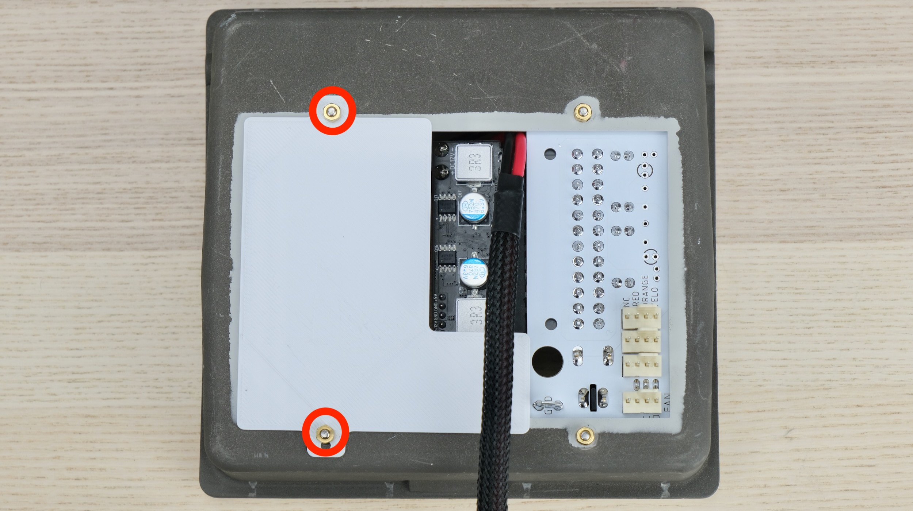

* Undo the locking ring on the barrel jack, insert through the hole, fasten it on the other side.

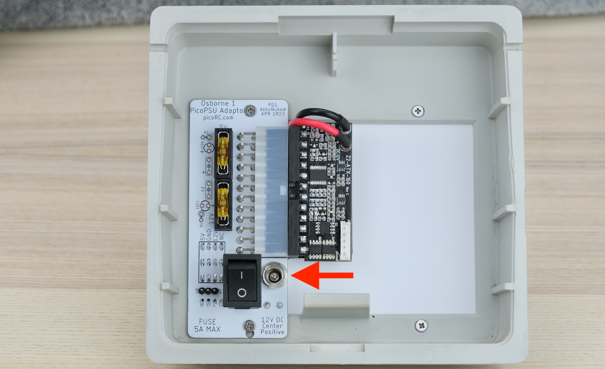

* Plug in the power connectors again

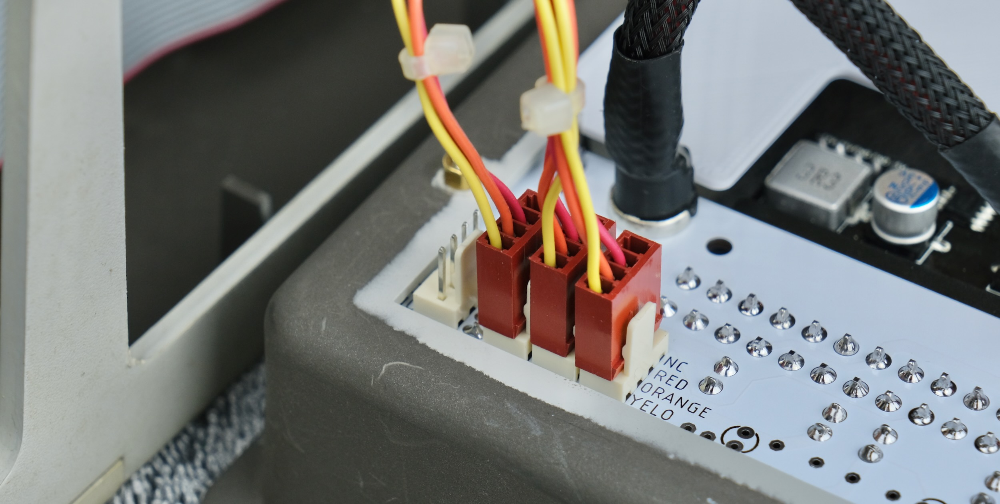

---------

**Adding a Fan**

If you want to add a fan, time to do it now.

Any standard PC fan should work.

**Don't mount the fan too close to the CRT**, or the picture might wobble from the motor's magnetic field.

Make sure the fan is secured, nothing touches the blade, and air flow direction is correct.

--------

* Insert the handle and power panel back in the case.

* Note the orientation, and **don't forget the door**!

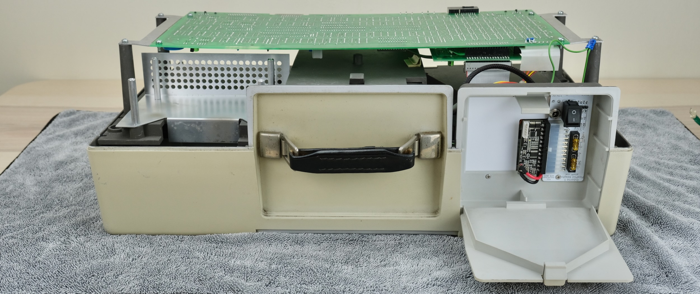

* Finally, plug in the green grounding strap.

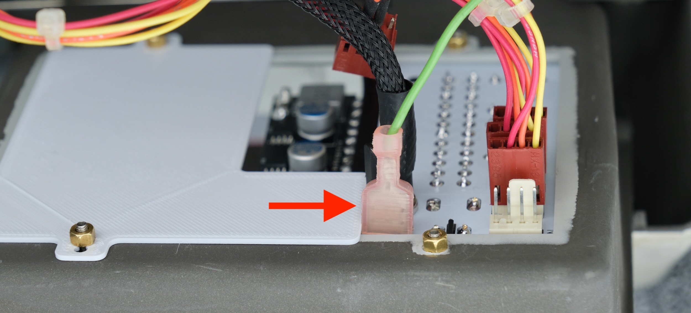

* That's pretty much it! Now you just have to put it back together!

## Congratulations!

With the new PSU, maintenance, and upgraded cooling, hope your Osborne 1 continue to provide exhilarating CP/M entertainment for years to come!

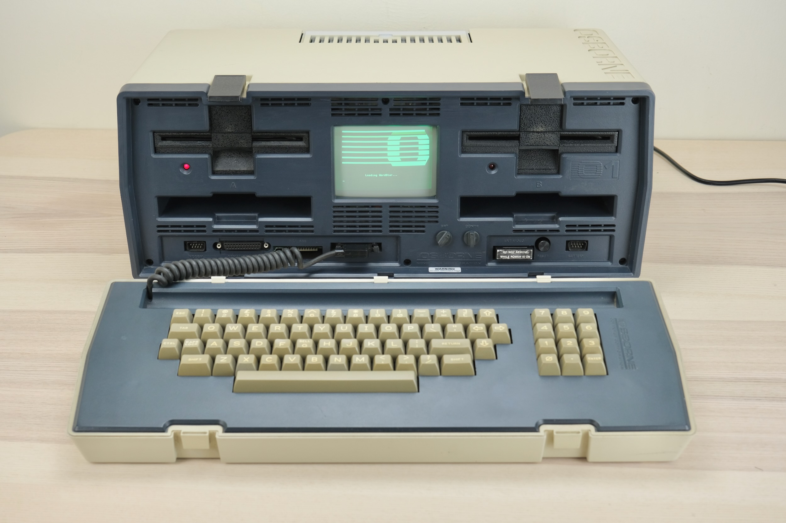

## Questions or Comments?

Feel free to ask in official [Discord Chatroom](https://discord.gg/T9uuFudg7j), raise a [Github issue](https://github.com/dekuNukem/PicoRC/issues), or email `dekunukem` `gmail.com`!
