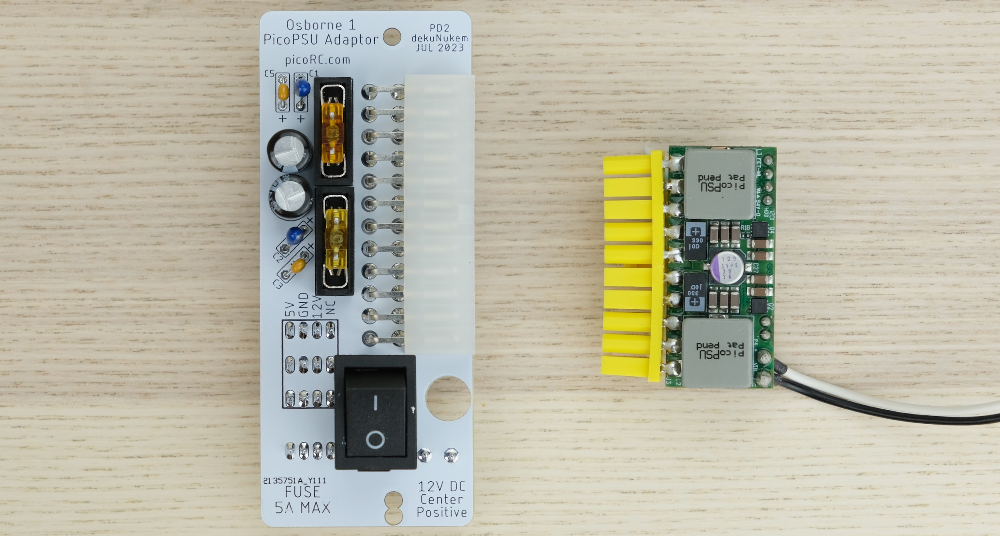
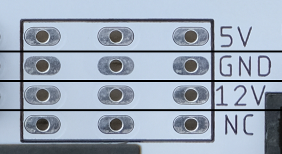
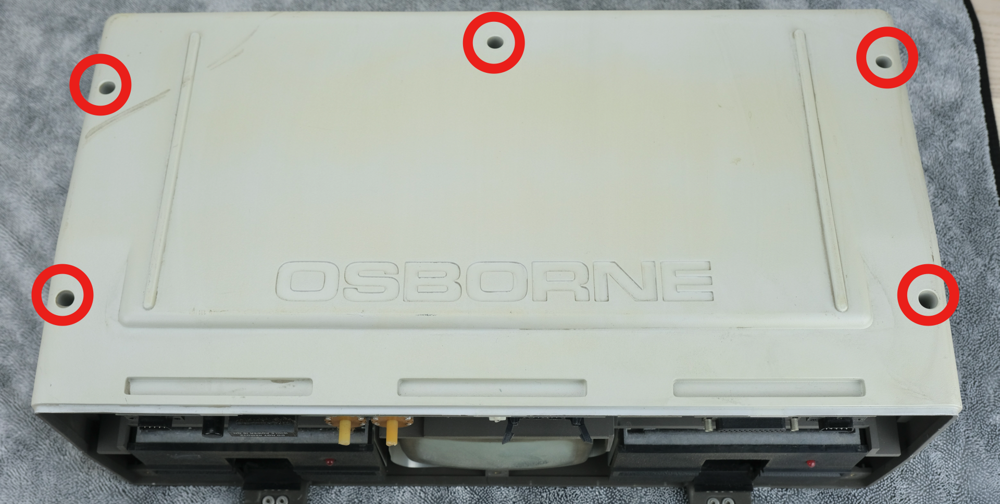
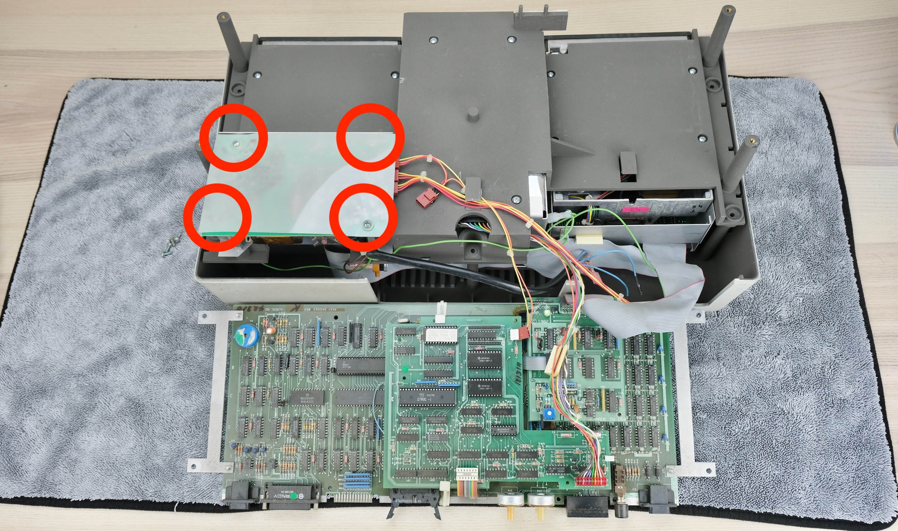
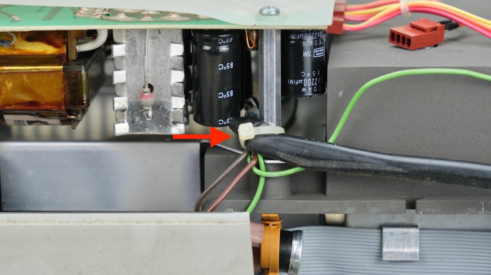

# PicoPSU Adaptor for Apple IIGS

Purchase Link | [Official Discord](https://discord.gg/HAuuh3pAmB) | [Table of Contents](#table-of-contents)

----

This adaptor lets you use **Pico ATX PSU** on Osborne 1 computer.

It replaces the original PSU, and uses very common **12V power brick** instead.

## Highlights

* **Non-destructive** and reversible

* **PC fan header** for added cooling

* **Fused** rails

* Low cost, efficient and reliable.

## Get One / Other Stuff

[Click me to get one!]

Also available for **Mac 128K, Mac SE, Apple II/IIGS, Osborne 1, and more!** [Check out the main page](./README.md) for details.

For more general-purpose diagnostics and retrofitting, check out the [full-fat ATX4VC](https://github.com/dekuNukem/ATX4VC)!

## Table of Contents

[Under Construction!]

## Getting a Pico PSU

PicoPSU are tiny ATX power supplies for small PCs, but are perfect for retro computers as well.

* [Official website](https://www.mini-box.com/DC-DC) and [distributors](https://www.mini-box.com/site/resellers.html). Even the cheapest 80W one should be plenty.

* You can also find generic ones on eBay/Amazon/Aliexpress by searching `Pico ATX`. They are *not that* cheap, so I strongly suggest supporting the high-quality official products.

* A power brick with **12V DC** and **center positive** 5.5x2.5mm barrel jack is needed.

* They are very popular and you might already have one. Make sure it has enough wattage.

Remember that this solution is **only as good as your PicoPSU and 12V Brick**, so don't skimp on them!

## Kit Assembly

**DON'T START YET!!!** Keep reading :)

### Required tools

* Soldering Iron

* Solder

* Flux

* Multimeter

### Parts

Observe the parts:

### Switch Preparation

Bend the pins

### Soldering Notes

Nothing too tricky in this kit, all basic through-hole stuff.

If this is your first time, a few tips:

* Make sure your soldering iron has **proper temperature control**, NOT the cheap ones with just a power switch! They get way too hot and will damage the PCB.

* Use **leaded solder**. Temperature around 320C / 600F

* Use plenty of flux to make things easier. You can clean it off afterwards.

* [This video](https://www.youtube.com/watch?v=AqvHogekDI4) covers the basics pretty well, you can also watch others by searching `how to solder`.

* Try your local makerspace or university lab too!

* Start from shortest to tallest. Solder **a single pin** first, check if part is straight.

### Assembly

On **top side**, solder the following components **as shown below**:

* Two fuse holders (push the metal contact all the way in)

* ATX connector

* 3-Pin male header

* Power Switch

Flip over, on **bottom side**, solder:

* Four 4-Pin Connectors

* Grounding Blade

More reference photos:

### Cleaning

This is optional, but I like to clean off the flux with 90%+ isopropyl alcohol.

Submerge and scrub with a toothbrush.

Make sure it is **completely dry** before proceeding.

### Inspection

* Compare with the reference photo and notes above. Make sure everything is in correct orientation.

* Solder joints should be **shiny and smooth**. If you see spikes, put on more flux and melt it again.

* There must be **no solder bridges**. If any, put on flux and melt it to remove.

## Board Features

Install **two fuses** and the **jumper block** as shown below.

### PC Fan Header

* Any standard 3 or 4-pin PC fan should work

* Run it at 12V (full speed) or 5V (quieter) by changing the jumper

### Fuse

* Use common car fuse rated **5A OR LESS**

* **DO NOT BYPASS FUSES**

## Pre-flight Checks

Use a multimeter to **check for dead shorts** between each power pin and GND:

If all good, plug in PicoPSU and connect the power button, turn it on.

**Measure the voltage on each rail** and confirm they are within spec.

## Installation

Some disassembly is coming up, make sure to **take plenty of photos** along the way! 

Snap one before removing a screw or unplugging a connector! It never hurts to have reference.

-------

I'm using a new-to-me and untested Osborne 1 in this guide, excuse the dust!

The adaptor should also work with the early version as well, although you'll need to take the whole innards out.

* Put it on a soft towel, unlatch and unplug the keyboard.

* Remove Brightness and contrast knob.

* Undo the tiny screw at the bottom, if doesn't exist, just pull it off.

* Undo the 6 face plate screws

* Organise your screws! 

* At each stage, put em in a bag with labels to avoid mix-ups.

* Flip it over, undo five screws and remove the back cover

* Lift off the handle plate

* Lift off the power panel

* Undo the four screws on the power panel

* On the back, unplug all the cables until the panel can be removed.

* Remove the four screws

* Hinge the motherboard toward you and rest it on the table

* Now it's a good time for an inspection

* This one has the "Screen-Pac" and dual-density floppy upgrade, neat!

* Once done, undo the four screws on the PSU. (Two under the plastic sheet)

* Cut the ziptie holding some cables

### Adding a Fan

You can add a fan for additional cooling.

Any regular PC fan should work, you can run it at 12V (full speed) or 5V (quieter).

Make sure the fan is secured, nothing touches the blade, and air flow direction is correct.

## Congratulations!

Put the cover back on, and you're done!

With new PSU and upgraded cooling, your IIGS should continue to provide entertainment for years to come!

What's with the wireless keyboard and mouse? [Check out USB4VC!](https://github.com/dekuNukem/USB4VC/blob/master/README.md)

## Questions or Comments?

Feel free to ask in official [Discord Chatroom](https://discord.gg/T9uuFudg7j), raise a [Github issue](https://github.com/dekuNukem/PicoRC/issues), or email `dekunukem` `gmail.com`!
